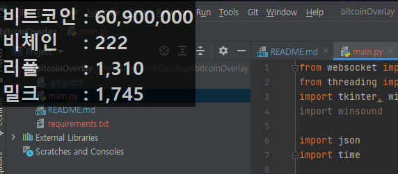

# bitcoinOverlay

### Draw an overlay on your Windows desktop.

## Install & Run

    pip install -r requirements.txt
    python main.py

### todo
    1. Specific price detection sound
    1. Get Asset Percent

### Configuration

## font
　(String) FontName
## fontSize
　(String) FontSize
## bold
　(Boolean) True or False
## position
　(String) Position (left/top)

|value|description|
|------|---|
|+0+0|left top
|+0-0|left bottom
|-0+0 |right top
|-0-0|right bottom

## realTopmost
　(Boolean) RealTime Topmost

## alpha
　(Float) Transparency

## foreground-color
　(String) foreground-color

　color text or RGB(#FFFFFF)

## background-color
　(String) foreground-color

　color text or RGB(#FFFFFF)

## transparent-color
　(String) Specifies a transparent color.

　color text or RGB(#FFFFFF)
　Blank or none if absent

---

### image
